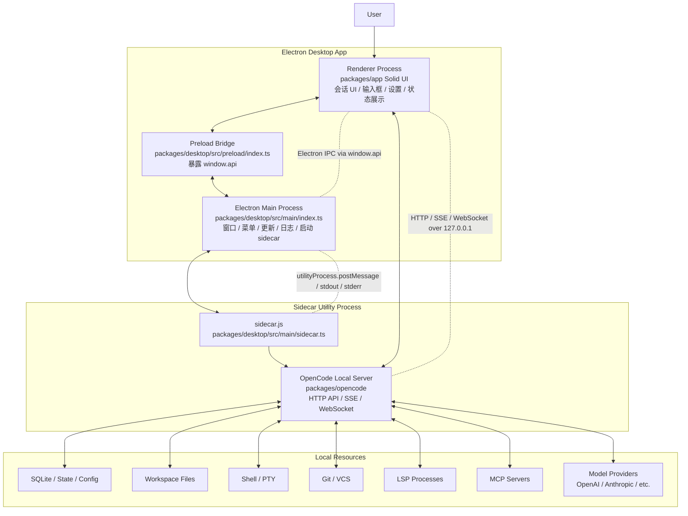
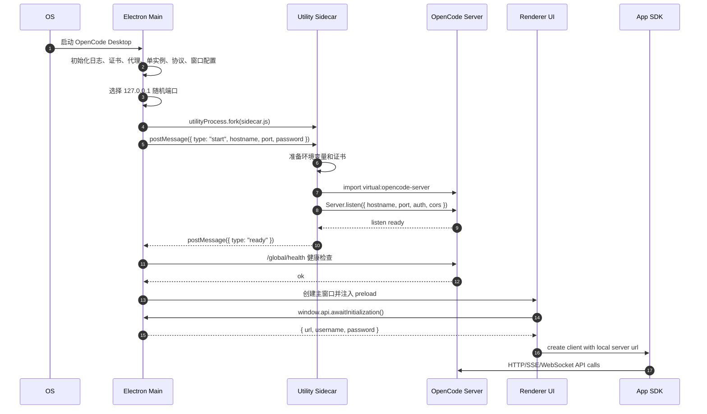
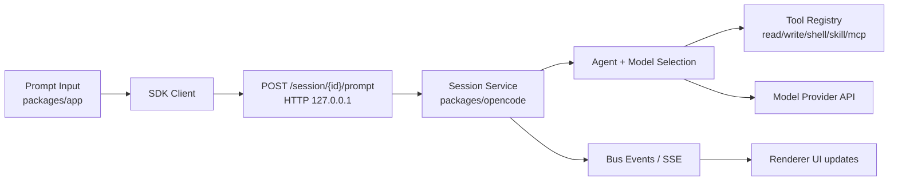
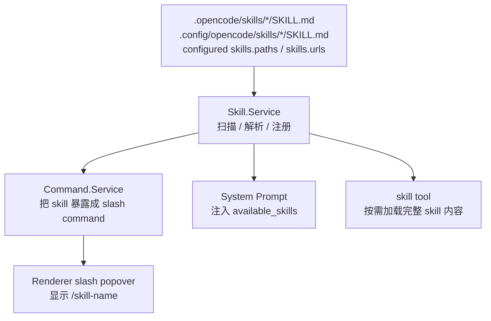

# OpenCode Desktop Architecture Overview

本文用于说明 OpenCode Windows 桌面端的整体架构、主要进程、进程间通信方式和启动流程。它面向二开维护场景，重点解释“大块之间怎么连起来”，不展开每个业务模块内部细节。

## 一句话架构

OpenCode 桌面版不是单个 Electron 页面完成所有逻辑，而是：

```text
Electron 桌面壳
  + Solid 前端 UI
  + 本地 OpenCode Server sidecar
  + 本地文件系统 / DB / Shell / Git / LSP / MCP / 模型 Provider
```

核心业务主要在 `packages/opencode`，桌面壳主要在 `packages/desktop`，通用前端 UI 主要在 `packages/app`。

## 主要包职责

| 目录 | 角色 | 主要职责 |
| --- | --- | --- |
| `packages/desktop` | Electron 桌面壳 | 启动窗口、菜单、更新、日志、preload IPC、启动本地 sidecar server |
| `packages/app` | 前端 UI | 会话界面、输入框、slash command、权限弹窗、设置页、项目/文件 UI |
| `packages/opencode` | 核心服务端 | Session、Agent、模型调用、工具调用、文件读写、Skill、MCP、权限、HTTP API、事件流 |
| `packages/sdk` | SDK | 给前端、TUI 或其他客户端调用 OpenCode Server API |
| `packages/ui` | UI 组件 | 通用 UI 组件和样式基础 |

## 桌面版进程图



## 进程与通信方式

| 两端 | 通信方式 | 用途 |
| --- | --- | --- |
| Renderer UI -> Electron Main | Electron IPC, 通过 `window.api` 和 `ipcRenderer.invoke/send` | 打开文件选择器、窗口控制、拿 sidecar 初始化信息、菜单命令、系统能力 |
| Electron Main -> Sidecar | Electron `utilityProcess` IPC, `postMessage/on("message")`, stdout/stderr pipe | 启动/停止本地 server、接收 ready/error/sqlite migration 进度、收集日志 |
| Renderer UI -> Sidecar Server | HTTP over `127.0.0.1:<port>` | 大部分业务 API：session、message、command、skill、project、permission 等 |
| Renderer UI -> Sidecar Server | SSE / event stream | 同步服务端事件、会话状态、消息变化 |
| Renderer UI -> Sidecar Server | WebSocket | PTY/terminal 等需要双向流式通道的能力 |
| Sidecar Server -> 外部工具 | 子进程、stdio、HTTP 等 | shell、git、rg、LSP、MCP、模型 Provider 调用 |

结论：桌面版确实是多进程。业务主链路使用本地 TCP HTTP 服务，但不是所有 IPC 都是 TCP。

## 启动流程图



## 启动伪代码

下面是简化后的逻辑，不是源码逐行翻译，只表达控制流。

```ts
// packages/desktop/src/main/index.ts
async function electronMain() {
  initLogging()
  initCrashReporter()
  setupProxyAndCertificates()
  ensureSingleInstance()

  const port = await findFreeLoopbackPort()
  const url = `http://127.0.0.1:${port}`
  const password = randomUUID()

  const { listener, health } = await spawnLocalServer("127.0.0.1", port, password, {
    userDataPath: app.getPath("userData"),
    needsMigration,
    onStdout: writeServerLog,
    onStderr: writeServerWarn,
  })

  await health.wait

  registerIpcHandlers({
    awaitInitialization: () => ({
      url,
      username: "opencode",
      password,
    }),
    killSidecar: () => listener.stop(),
    openDirectoryPicker,
    openPath,
    setDefaultServerUrl,
  })

  createMainWindow()
}
```

```ts
// packages/desktop/src/main/server.ts
async function spawnLocalServer(hostname, port, password, options) {
  const child = utilityProcess.fork("sidecar.js", [], {
    serviceName: "opencode server",
    stdio: "pipe",
  })

  child.postMessage({
    type: "start",
    hostname,
    port,
    password,
    userDataPath: options.userDataPath,
    needsMigration: options.needsMigration,
  })

  await waitUntilChildPostsReady()
  const health = waitForHttpHealth(`http://${hostname}:${port}`, password)

  return {
    listener: {
      stop: () => child.postMessage({ type: "stop" }),
    },
    health,
  }
}
```

```ts
// packages/desktop/src/main/sidecar.ts
async function start(command) {
  prepareSidecarEnv(command.password, command.userDataPath)

  const { Server } = await import("virtual:opencode-server")

  listener = await Server.listen({
    hostname: command.hostname,
    port: command.port,
    username: "opencode",
    password: command.password,
    cors: ["oc://renderer"],
  })

  parentPort.postMessage({ type: "ready" })
}
```

```ts
// packages/desktop/src/preload/index.ts
contextBridge.exposeInMainWorld("api", {
  awaitInitialization: () => ipcRenderer.invoke("await-initialization"),
  openDirectoryPicker: (opts) => ipcRenderer.invoke("open-directory-picker", opts),
  setDefaultServerUrl: (url) => ipcRenderer.invoke("set-default-server-url", url),
})
```

```ts
// renderer / packages/app side
async function bootRenderer() {
  const sidecar = await window.api.awaitInitialization()

  const client = createOpencodeClient({
    baseUrl: sidecar.url,
    username: sidecar.username,
    password: sidecar.password,
  })

  await client.session.list()
  subscribeServerEvents()
}
```

## 请求链路示例

以用户在输入框提交一句话为例：



简化伪代码：

```ts
// packages/app
await sdk.client.session.promptAsync({
  sessionID,
  agent,
  model,
  parts,
})

// packages/opencode server
async function handlePrompt(request) {
  const session = await loadSession(request.sessionID)
  const agent = await resolveAgent(request.agent)
  const model = await resolveModel(request.model)

  const response = await runModelLoop({
    session,
    agent,
    model,
    tools: toolRegistry.forAgent(agent),
  })

  publishEvents(response)
}
```

## Skill / Command 在架构里的位置

Skill 不是 renderer 自己扫描文件。它属于 `packages/opencode` 服务端能力：



使用上有两种方式：

1. 用户在 UI 输入 `/skill-name`，它作为 command 进入服务端。
2. 模型看到系统提示里的 available skills，自动调用 `skill` tool 加载完整内容。

## 为什么这样拆

这种设计有几个实际收益：

| 设计 | 收益 |
| --- | --- |
| UI 和核心服务分离 | UI 崩溃或刷新不等于核心服务逻辑全部重启 |
| 本地 HTTP API | 同一套 `packages/opencode` 可以服务 Desktop、Web UI、TUI、SDK |
| sidecar 独立进程 | 文件系统、shell、git、PTY、LSP、MCP 等高风险能力不直接塞进 renderer |
| preload IPC 只暴露必要能力 | renderer 不直接拿到完整 Node/Electron 权限 |
| 事件流同步 UI | 服务端状态变化可以主动推给 UI |

## 关键源码入口

| 主题 | 文件 |
| --- | --- |
| Electron main 启动 | `packages/desktop/src/main/index.ts` |
| sidecar 进程启动管理 | `packages/desktop/src/main/server.ts` |
| sidecar 进程入口 | `packages/desktop/src/main/sidecar.ts` |
| preload IPC 暴露 | `packages/desktop/src/preload/index.ts` |
| renderer 入口 | `packages/desktop/src/renderer/index.tsx` |
| 前端 App 入口 | `packages/app/src/entry.tsx` |
| 前端 SDK/context | `packages/app/src/context/global-sdk.tsx` |
| OpenCode Server listen | `packages/opencode/src/server/server.ts` |
| HTTP API 路由聚合 | `packages/opencode/src/server/routes/instance/httpapi/server.ts` |
| Session prompt 主流程 | `packages/opencode/src/session/prompt.ts` |
| Skill 服务 | `packages/opencode/src/skill/index.ts` |
| Command 服务 | `packages/opencode/src/command/index.ts` |

## 记忆模型

后续排查时可以先按这条线判断问题归属：

```text
窗口/菜单/更新/本地服务拉起失败
  -> packages/desktop main/preload

页面显示、输入框、设置、交互体验
  -> packages/app

session、agent、tool、skill、mcp、权限、模型调用、文件操作
  -> packages/opencode

API 类型或客户端调用封装
  -> packages/sdk
```
